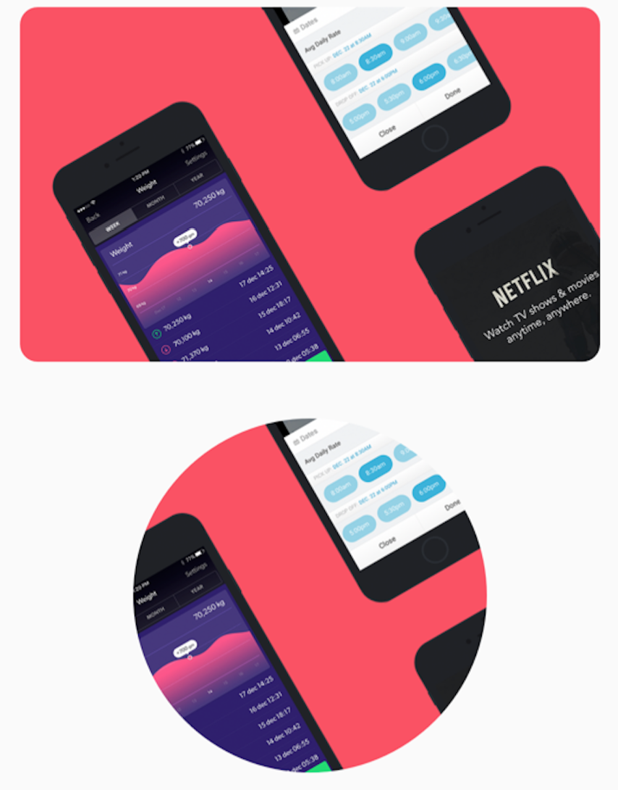

# RoundCornerImageView

A RoundCornerImageView like this:



# Installation

gradle:

```
compile 'com.liuzhuang.opensource:rcimageview:0.0.2'
```

or maven:

```
<dependency>
  <groupId>com.liuzhuang.opensource</groupId>
  <artifactId>rcimageview</artifactId>
  <version>0.0.1</version>
  <type>pom</type>
</dependency>
```

# Usage

Add `xmlns` to XML file:

```
xmlns:rc="http://schemas.android.com/apk/res-auto"
```

## Round Corner ImageView

```
<com.android.liuzhuang.rcimageview.RoundCornerImageView
    android:layout_width="match_parent"
    android:layout_height="200dp"
    android:src="@mipmap/demo"
    android:scaleType="centerCrop"
    rc:rciv_radius="10dp"/>
```

## Circle ImageView

```
<com.android.liuzhuang.rcimageview.CircleImageView
    android:layout_width="match_parent"
    android:layout_height="200dp"
    android:src="@mipmap/demo"
    android:scaleType="centerCrop"/>
```

`CircleImageView` uses minimum of its width and height as radius by default. If you want to control the radius, use `rc:radius="64dp"`.

# Advantages

1. Does not copy bitmap.
2. Only draw once.
3. Supports alpha, antialisasing and hardware acceleration.